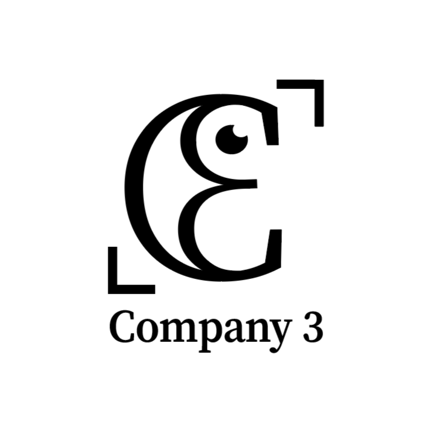
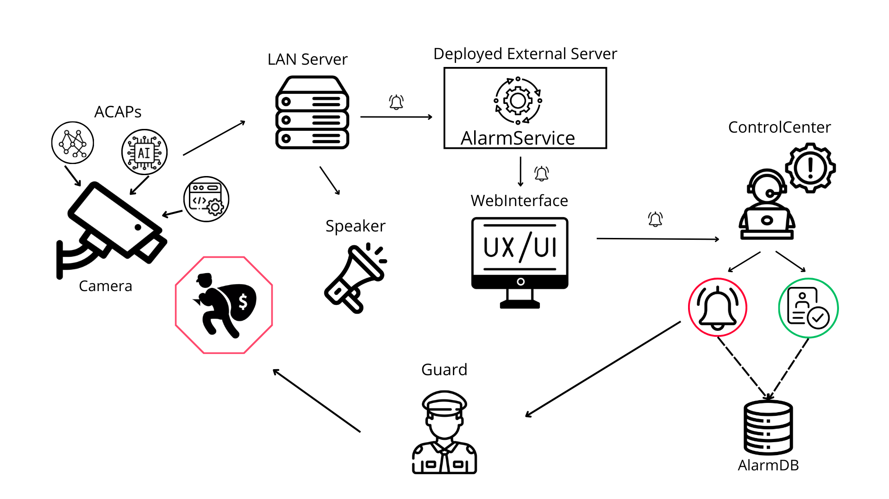

  

---

## PanoraGuard — Security Surveillance System

**PanoraGuard** is a full-stack security surveillance system developed as part of the course  
**TDDC88 – Software Engineering** at **Linkoping University** (Fall 2024).

The project was carried out by **Company 3** in collaboration with **Axis Communications**, who acted as a real-world client by providing requirements, feedback, and domain constraints.

---

  
  

---

> ⚠️ **Important Note**  
> This repository is a **personal portfolio version** of a team project.  
> It is intended to showcase **my individual contributions, leadership responsibilities, and technical work**.

---

## 🎥 Demo & Live System

  

- **Final Product Demo Pitch**: https://www.youtube.com/watch?v=JkDI--DhFnU  

---

## Follow the Journey

- [**Demo iteration 2**](https://drive.google.com/file/d/1ICRIwVadDdsYsEZzZyCarr14lxmGuBHL/view?usp=drive_link)
- [**Demo iteration 3**](https://drive.google.com/file/d/1vbIL0ewWdcuGKRSdi8LCC5NupxmdV6Gc/view?usp=drive_link)
- [**Final Product Demo Pitch**](https://www.youtube.com/watch?v=JkDI--DhFnU&t=1s)

---

## Who are we?

Learn more about us on our company website:  
[**Company Website**](https://company-members-rajag969-b760ce3a61d886c9508e8e542a6936a0f6ede1.gitlab-pages.liu.se/)

---

## My Role

**Lead Developer & UX Lead**

I held a dual leadership role, responsible for both **technical direction** and **user experience design**, ensuring the system was scalable, usable, and aligned with client requirements.

### Responsibilities

- Led system-level **architecture and technical decision-making**
- Designed and owned the **frontend UX** for operators, admins, and managers
- Coordinated development work across team members
- Acted as the main technical representative during client demos and reviews
- Ensured alignment between **business requirements**, **engineering constraints**, and **user needs**

---

## My Contributions

### Frontend & UX

- Designed user flows for alarm handling, validation, and escalation
- Built real-time operator dashboards using WebSockets
- Implemented alarm lifecycle workflows (trigger → review → dismiss / notify)
- Focused on usability in **high-pressure security scenarios**

### Backend & System Integration

- Contributed to alarm creation logic and system communication design
- Integrated frontend with cloud backend and LAN server
- Worked with real camera data (confidence scores, snapshots, live feeds)
- Helped define API contracts between system components

### Engineering Practices

- Worked in an **agile, iteration-based development process**
- Participated in requirement refinement with the client
- Helped define acceptance criteria and demo goals
- Performed code reviews to maintain architectural consistency

---

## What is PanoraGuard?

PanoraGuard combines **hardware** and **software** to provide automated alarms and real-time monitoring, designed to enhance security during periods of low activity or restricted access.

### Core Features

- Automated alarms based on object detection confidence thresholds
- Real-time operator notifications with snapshots and live camera feeds
- Alarm dismissal and guard-notification workflows
- Integrated speaker-based deterrence
- Admin & manager tools for configuration, scheduling, and historical analysis

---

## System Overview

PanoraGuard is a distributed system integrating both hardware and software components.

### Hardware

- **AXIS Cameras** running custom ACAPs for object detection
- **Speaker System** for audible warnings
- **LAN Server (Host Machine)** for local device management

### Software

- **ACAP**: Custom applications deployed on cameras
- **Client**: Web-based GUI for operators, admins, and managers
- **External Server**: Cloud-hosted backend for alarms, business logic, and database
- **LAN Server**: Local server managing cameras, schedules, and live feeds

### Data Flow (High-Level)

1. Cameras detect objects and send metadata to the LAN server  
2. LAN server forwards data to the external cloud server  
3. Cloud server applies business logic and creates alarms  
4. Speaker alerts are triggered if required  
5. Frontend is updated in real time via WebSockets  
6. Operators dismiss alarms or notify guards  
7. Admins configure thresholds, schedules, and camera settings  

---

## How to Run the System

### Running Locally

1. Clone the repository and follow setup instructions in `/Client` and `/Server`
2. Connect cameras and speakers to the same network
3. Install ACAPs on cameras (see `/ACAP` README)
4. Start:
   - LAN Server
   - External Server
   - Client
5. Open the client application in your browser

### Running in the Cloud

1. Set up cameras and speakers on the same network as the LAN server
2. Install ACAPs with the correct LAN server endpoint
3. Start the LAN server on the host machine
4. Access the system at https://panoraguard.se/

---

## Additional Information

Detailed setup instructions are available in the following directories:

- `/ACAP`
- `/Client`
- `/Server`

---

## Why This Project Is Relevant

This project mirrors professional industry development and demonstrates my ability to:

- Work with **real industrial clients**
- Lead development in a **multi-component distributed system**
- Design **user-centered UX** for complex workflows
- Balance technical depth with product and usability concerns
- Deliver under real deadlines with live demos and stakeholder feedback

---

## Disclaimer

This repository is intended **for portfolio and job application purposes only**.

All branding, requirements, and system context originate from an academic collaboration with AXIS Communications as part of coursework at Linköping University.
